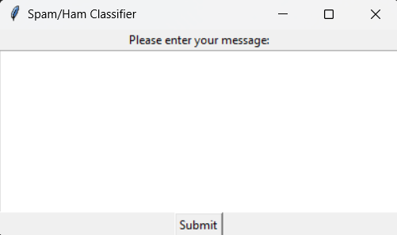
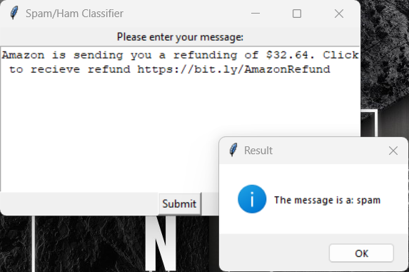
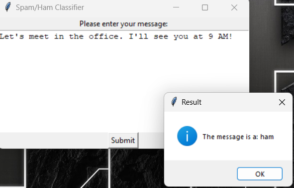

# Spam Classifier Application

This application features a GUI for classifying text from user input as spam or ham using a Naive Bayes algorithm for machine learning. The model is trained to analyze the text from a dataset from Kaggle.
https://www.kaggle.com/datasets/zubairmustafa/spam-and-ham-classification-balanced-dataset

## Features

- **Model Training**: Load dataset, preprocess text data, split dataset, train a Naive Bayes classifier, evaluate the model, and save the trained model and vectorizer.
- **Model Loading**: Load the pre-trained model and vectorizer from disk.
- **Text Classification**: Classify user input text as spam or ham using the trained model.
- **Graphical User Interface (GUI)**: A Tkinter-based GUI for entering text and displaying classification results.

## Requirements

- Python 3.x
- pandas
- scikit-learn
- joblib
- tkinter

## Usage

1. **Training the Model**:
   - Ensure your dataset (`spam_and_ham_classification.csv`) is in the same directory as the script.
   - Uncomment the `train_model()` call in the main execution block if the model is not already trained and saved.
   - Run the script to train the model and save it to disk.

2. **Running the Application**:
   - Ensure the model and vectorizer are saved in the current directory (`spam_classifier_model.pkl` and `tfidf_vectorizer.pkl`).
   - Run the script to launch the GUI.
   - Enter your message in the text box and click "Submit" to classify the message as spam or ham.

## Screenshots

### Main Interface

### Classification Result
-output from a real spam message I recieved.

-output from a real text I recieved.

## File Descriptions

- `spam_classifier.py`: Main script containing functions for model training, loading, text classification, and GUI creation.
- `spam_and_ham_classification.csv`: (Required for training) Dataset containing labeled messages for spam and ham classification.
- `spam_classifier_model.ipynb`: jupyter notebook conating the same training and testing of model with detail explanation of the steps.

## How to Contribute

Feel free to open issues or submit pull requests with improvements or bug fixes. Contributions are welcome!

## Disclaimer

This project is not 100% accurate!
